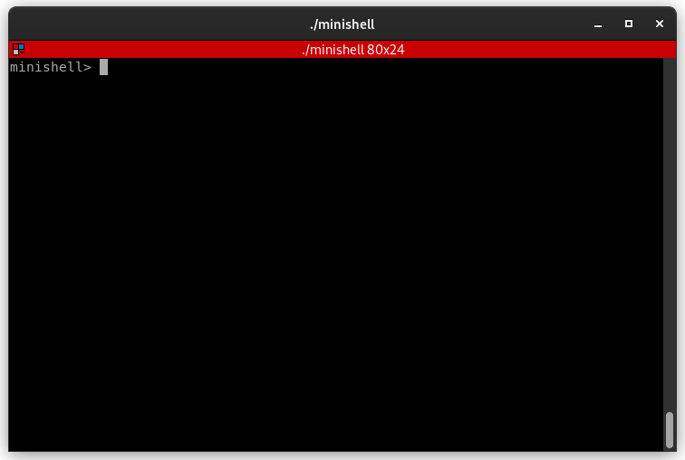

# minishell



## General usage

### installation
```bash
git clone git@github.com:louakedwayl/minishell.git && cd minishell && make
```

### start minishell
```bash
./minishell
```

## Description

Write a shell.

## Shell Requirements Summary

## Main Features
- **Prompt and History**  
  - Displays a prompt when waiting for a command.  
  - Keeps a working command history.

- **Command Execution**  
  - Executes programs based on the `PATH` variable or using relative/absolute paths.

- **Global Variable**  
  - Only **one global variable** allowed, used exclusively to store the number of a received signal.

- **Quote Handling**  
  - **Single quote `'`**: content is taken literally, no expansions.  
  - **Double quote `"`**: content is literal except for variable expansion with `$`.

- **Redirections**  
  - `<` : input redirection.  
  - `>` : output redirection (overwrite).  
  - `>>` : output redirection in append mode.  
  - `<<` : heredoc, reads input until a delimiter is reached.

- **Pipes**  
  - `|` : connects the output of one command to the input of the next.

- **Variable Expansion**  
  - `$VAR` : replaced by the value of the environment variable.  
  - `$?` : replaced by the exit status of the last executed command.

- **Signal and Control Handling**  
  - **Ctrl-C** : interrupts the current command and shows a new prompt.  
  - **Ctrl-D** : exits the shell.  
  - **Ctrl-\\** : does nothing.

- **Built-in Commands**  
  - `echo` with `-n` option.  
  - `cd` with relative or absolute path.  
  - `pwd` without options.  
  - `export` to set environment variables.  
  - `unset` to remove environment variables.  
  - `env` to display all environment variables.  
  - `exit` to quit the shell.
